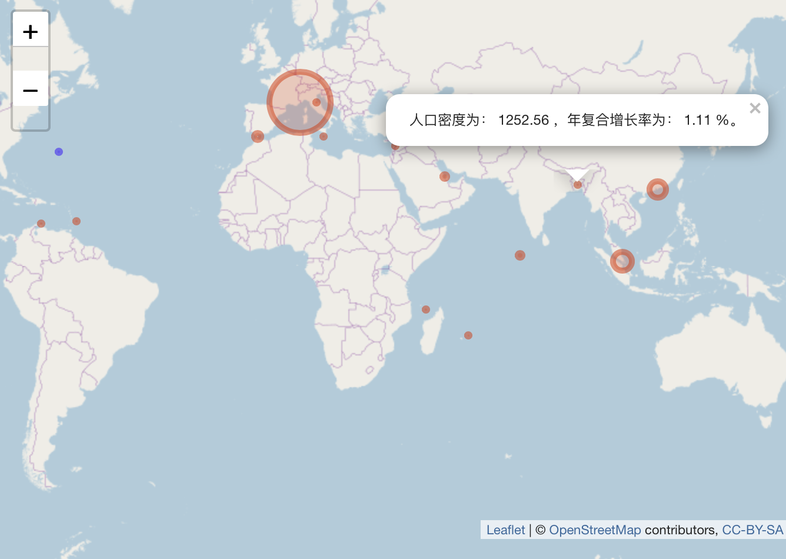
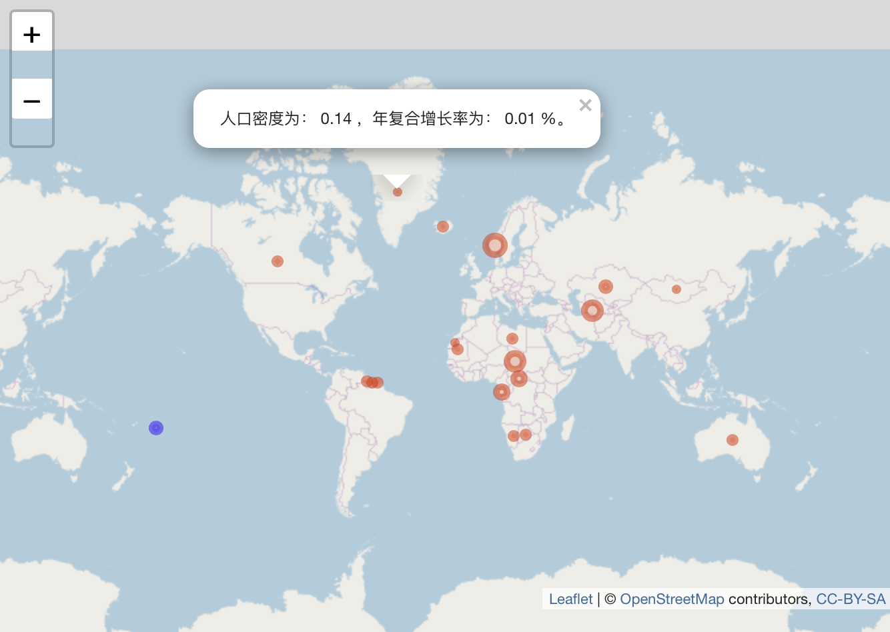

```{r setup, include=FALSE}
knitr::opts_chunk$set(echo = FALSE, warning = FALSE, comment = "")
library(tidyverse)
library(magrittr)
library(knitr)
```

\newpage

\tableofcontents

***

\begin{center}

网页

http://wuyuchong.com/projects/population

\end{center}

***

\begin{center}

源代码及数据

https://github.com/wuyuchong/world\_population

\end{center}

***

# 说明

在此统计中，共有235个国家和地区。

十年内，由于不同国家和地区统计年份有所不同，故计算的是近十年的年复合增长率（即剔除了非十年内的数据）:

$$ FV = PV \times (1 + CAGR) ^ {years} $$

```{r}
dat = read.csv("Population+Surface+Area+and+Density.csv", header = TRUE)
dat = dat[900:nrow(dat),]
dat = dat %>% 
  select(X, Year, Series, Value) 
coordinate = read.csv("coordinate.csv", header = TRUE)
# Definition
CAGR_formula = function(FV, PV, yrs) 
{
  values = ((FV/PV)^(1/yrs)-1)
  return(values)
}
```

# 2019年人口密度

```{r}
dat_2019 = dat %>% 
  filter(Year == 2019, Series == 	"Population density") %>% 
  arrange(Value)

name_under = dat_2019$X[1:23] %>% 
  as.vector()
name_over = dat_2019$X[nrow(dat_2019):(nrow(dat_2019) - 22)] %>% 
  as.vector()

dat_density = dat %>% 
  filter(Series == "Population density")
```

```{r}
dat_under = NULL
for(i in name_under)
{
  table = filter(dat_density, X == i, Year >= 2009)
  CAGR = CAGR_formula(table$Value[nrow(table)], table$Value[1], table$Year[nrow(table)] - table$Year[1]) * 100
  density = table$Value[nrow(table)]
  note = paste("人口密度为：", round(density, 2), "，年复合增长率为：", round(CAGR, 2), "%。")
  row = data.frame(country = i, density = density, CAGR = CAGR, note = note)
  dat_under = rbind(dat_under, row)
}

dat_over = NULL
for(i in name_over)
{
  table = filter(dat_density, X == i, Year >= 2009)
  CAGR = CAGR_formula(table$Value[nrow(table)], table$Value[1], table$Year[nrow(table)] - table$Year[1]) * 100
  density = table$Value[nrow(table)]
  note = paste("人口密度为：", round(density, 2), "，年复合增长率为：", round(CAGR, 2), "%。")
  row = data.frame(country = i, density = density, CAGR = CAGR, note = note)
  dat_over = rbind(dat_over, row)
}
```

## 世界90%分位点以上的国家

```{r warning=FALSE}
dat_over = left_join(dat_over, coordinate, by = "country")
color = NULL
for(i in 1:nrow(dat_over))
{
  if(dat_over$CAGR[i] <= 0)
  {
    color = c(color, "blue")
  } else
  {
    color = c(color, "red")
  }
}
dat_over = cbind(dat_over, color)
```

```{r fig.cap="悬浮查看国家名，点击查看密度和年复合增长率（蓝色为负增长）", out.width="90%", fig.align='center',  fig.pos='H'}

```

***

\begin{center}

前往网页查看动态地图

http://wuyuchong.com/projects/population

\end{center}

***

```{r fig.cap="世界人口密度90分位点以上的国家（颜色为年复合增长率）", out.width="90%", fig.align='center',  fig.pos='H'}
dat_over %>% 
  ggplot() +
  scale_fill_gradient(low="white", high="red") +
  geom_col(aes(x = reorder(country, density), y = density, fill = CAGR)) +
  theme_minimal() +
  coord_flip() +
  labs(x = "Country", y = "Density", fill = "growth rate (%)")
```

## 世界10%分位点以下的国家

```{r warning=FALSE}
dat_under = left_join(dat_under, coordinate, by = "country")
color = NULL
for(i in 1:nrow(dat_under))
{
  if(dat_under$CAGR[i] <= 0)
  {
    color = c(color, "blue")
  } else
  {
    color = c(color, "red")
  }
}
dat_under = cbind(dat_under, color)
```

```{r fig.cap="悬浮查看国家名，点击查看密度和年复合增长率（蓝色为负增长）", out.width="90%", fig.align='center',  fig.pos='H'}

```

***

\begin{center}

前往网页查看动态地图

http://wuyuchong.com/projects/population

\end{center}

***

```{r fig.cap="世界人口密度10分位点以下的国家（颜色为年复合增长率）", out.width="90%", fig.align='center', fig.pos='H'}
dat_under %>% 
  ggplot() +
  scale_fill_gradient(low="white", high="red") +
  geom_col(aes(x = reorder(country, -density), y = density, fill = CAGR)) +
  theme_minimal() +
  coord_flip() +
  labs(x = "Country", y = "Density", fill = "growth rate (%)")
```

# 2019年人口规模

```{r}
dat_2019 = dat %>% 
  filter(Year == 2019, Series == "Population mid-year estimates (millions)") %>% 
  arrange(Value)

name_under = dat_2019$X[1:23] %>% 
  as.vector()
name_over = dat_2019$X[nrow(dat_2019):(nrow(dat_2019) - 22)] %>% 
  as.vector()

dat_population = dat %>% 
  filter(Series == "Population mid-year estimates (millions)")
```

```{r}
dat_under = NULL
for(i in name_under)
{
  table = filter(dat_population, X == i, Year >= 2009)
  CAGR = CAGR_formula(table$Value[nrow(table)], table$Value[1], table$Year[nrow(table)] - table$Year[1])
  row = data.frame(country = i, population = table$Value[nrow(table)], CAGR = CAGR * 100)
  dat_under = rbind(dat_under, row)
}

dat_over = NULL
for(i in name_over)
{
  table = filter(dat_population, X == i, Year >= 2009)
  CAGR = CAGR_formula(table$Value[nrow(table)], table$Value[1], table$Year[nrow(table)] - table$Year[1])
  row = data.frame(country = i, population = table$Value[nrow(table)], CAGR = CAGR * 100)
  dat_over = rbind(dat_over, row)
}
```

## 世界90%分位点以上的国家

```{r}
names(dat_over) = c("国家(地区)", "人口(2019)", "年复合增长率(%)")
dat_over %>% 
  kable(caption = "2019年人口较多的国家人口规模情况", digits = 2)
```

## 世界10%分位点以下的国家

```{r}
names(dat_under) = c("国家(地区)", "人口(2019)", "年复合增长率(%)")
dat_under %>% 
  kable(caption = "2019年人口较少的国家人口规模情况", digits = 2)
```


***

\begin{center}

网页

http://wuyuchong.com/projects/population

\end{center}

***

\begin{center}

源代码及数据

https://github.com/wuyuchong/world\_population

\end{center}

***

